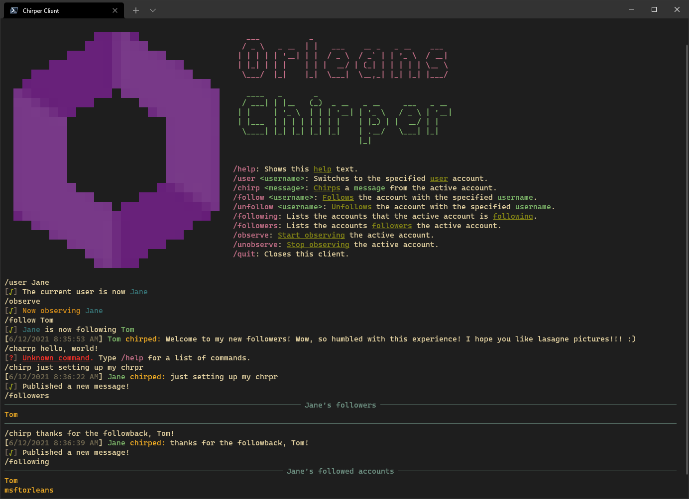

# Orleans Chirper Social Media sample app

This sample demonstrates a simple social network pub/sub system, with short text messages being sent between users.

Publishers send out short *"Chirp"* messages (not to be confused with *"Tweets"*, for a variety of legal reasons) to any other users that are following them.

The sample consists of two applications, `Chirper.Server` which hosts Orleans and all of the grains, and `Chirper.Client` which hosts an Orleans client, and the terminal interface seen in the above screenshot.

The sample demonstrates the following features of Orleans:

* Grain persistence - for storing the state of a grain in a database
* Reentrant grains - for allowing multiple calls to concurrently interleave each other
* Grain observers - for sending push messages back to clients

In this project, in-memory persistence is used (see *Program.cs*), but it can be substituted for a persistence provider of your choice without changing the grain code. Only the configuration needs to change to use a different persistence provider.

## How is it modeled

Chirper users are modeled as grains: Each user is an independent grain.

By modeling each user as a grain, the messaging load is distributed, with each grain handling the forwarding of messages generated by that user to any other users that are following them.

The grains implement three different grain interfaces to represent the three functional facets of those entities - `IChirperPublisher`, `IChirperSubscriber` and `IChirperAccount`

There is also an `IChirperViewer` observer interface for applications to subscribe for status changes from a particular Chirper user without becoming a Follower. This observer interface is typically used when writing client UI applications such as `ChirperClient`.

## Building the sample

[`dotnet build`](https://docs.microsoft.com/dotnet/core/tools/dotnet-run) from the root directory.

## Running the sample
In one terminal window, `cd Chirper.Server` and `dotnet run`.

In one or more other terminal windows, `cd Chirper.Client` and `dotnet run`.
